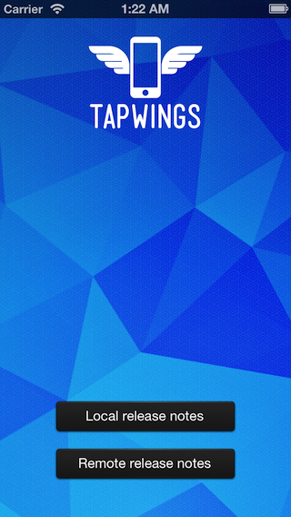
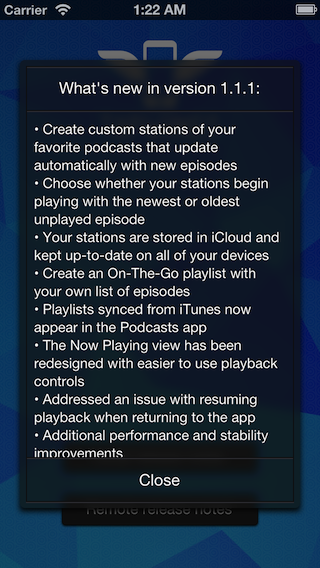

TWSReleaseNotesView
===================

Among other crazy features, iOS 7 enables users to have automatic updates for their apps, wiping away the infamous App Store badge. This is really convenient both for users and developers, but it comes with a couple of downsides:

* users are not aware about the changes introduced in the latest update, unless they explicitly open the App Store page to check the release notes;
* developers who spend their time working on well-written release notes lose their chance to inform and communicate with their users.

## So what?
TWSReleaseNotesView is a simple way to address those issues. It comes with a straightforward API which enables developers to show in-app release notes with a fully customizable popup view.


## How to get started
1. Download the TWSReleaseNotesView folder and add it to your project.
2. In addition to the default `UIKit`, `CoreGraphics` and `Foundation`, there's a dependency from the `Accelerate` and the `Quartzcore` frameworks. If any of them is missing in your Frameworks list, follow these steps in order to add them:
  * Go to the "Build Phases" tab for your project target.
  * Click the `+` button in the collapsible "Link Binary With Libraries" section.
  * Add the missing frameworks.
3. That's it!

# Example usage

## Version check and local release notes view setup
```objective-c
    // Check for app update
    if ([TWSReleaseNotesView isAppVersionUpdated])
    {
        // Create the release notes view
        NSString *currentAppVersion = [[NSBundle mainBundle] infoDictionary][@"CFBundleVersion"];
        TWSReleaseNotesView *releaseNotesView = [TWSReleaseNotesView viewWithReleaseNotesTitle:[NSString stringWithFormat:@"What's new in version %@:", currentAppVersion] text:@"• Great new feature\n• Annoying bug wiped away\n• Optimizations and other great stuff!\n• Additional performance and stability improvements" closeButtonTitle:@"Close"];
        
        // Show the release notes view
        [releaseNotesView showInView:self.view];
    }
```

## Version check and remote release notes view setup
```objective-c
    // Check for app update
    if ([TWSReleaseNotesView isAppVersionUpdated])
    {
        // Setup a remote release notes view
        NSString *currentAppVersion = [[NSBundle mainBundle] infoDictionary][@"CFBundleVersion"];
        [TWSReleaseNotesView setupViewWithAppIdentifier:@"XXXXXXXXX" releaseNotesTitle:[NSString stringWithFormat:@"What's new in version %@:", currentAppVersion] closeButtonTitle:@"Close" completionBlock:^(TWSReleaseNotesView *releaseNotesView, NSString *releaseNotesText, NSError *error){
            if (error)
            {
                // Handle errors
                NSLog(@"An error occurred: %@", [error localizedDescription]);
            }
            else
            {                
                // Create and show release notes view
                [releaseNotesView showInView:self.view];
            }
        }];
    }
```

## Sample project
The **TWSReleaseNotesViewSample** sample project shows how to deal with the two use cases described above.

    

## Features
* Version check in order to choose whether showing the release notes view or not.
* Local release notes view with custom appearance and text information.
* Remote release notes view using the application's Apple ID, in order to retrieve the last release notes directly from App Store, using the iTunes Search API.

## Documentation
The code is fully commented using a [Javadoc](http://en.wikipedia.org/wiki/Javadoc)-like syntax, in order to use [appledoc](https://github.com/tomaz/appledoc) for the documentation generation. Check the **TWReleaseNotesView Docs** folder for the complete documentation, in both html and .docset format. The .docset file can be copied in the `~/Library/Developer/Shared/Documentation/DocSets` folder, in order to be able to read the documentation in Xcode. If you decide to do so, please, remember to close Xcode before copying the .docset file in the proper folder, then re-open it.

## Credits
TWSReleaseNotesView was developed by **Tapwings**: Matteo Lallone (iOS developer) and Gianluca Divisi (UI/UX designer). Follow us on Twitter ([@tapwings](https://twitter.com/tapwings)) to receive updates on our work.
